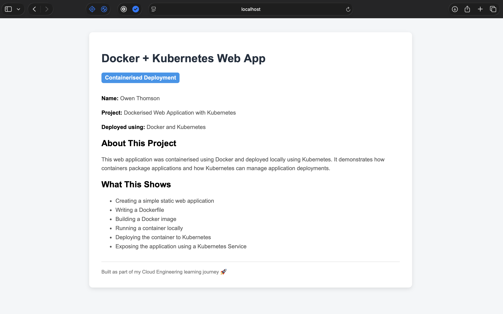
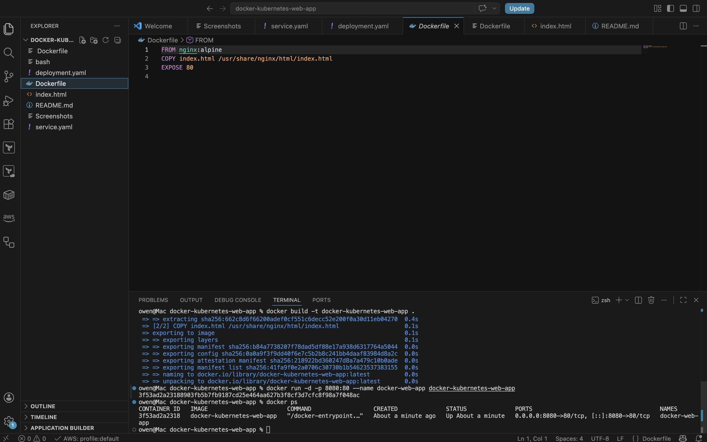
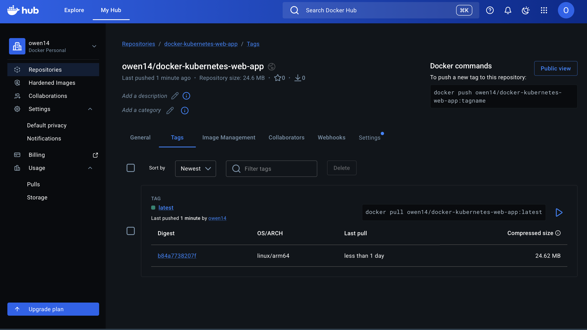
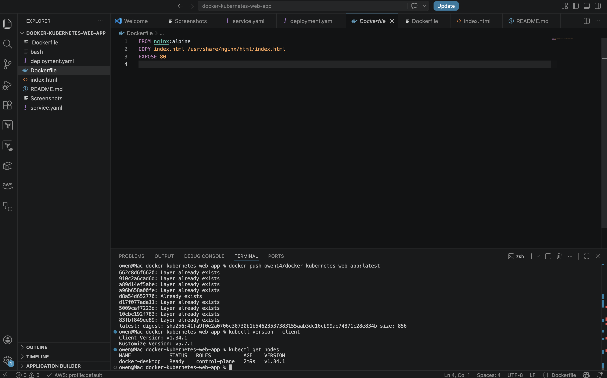
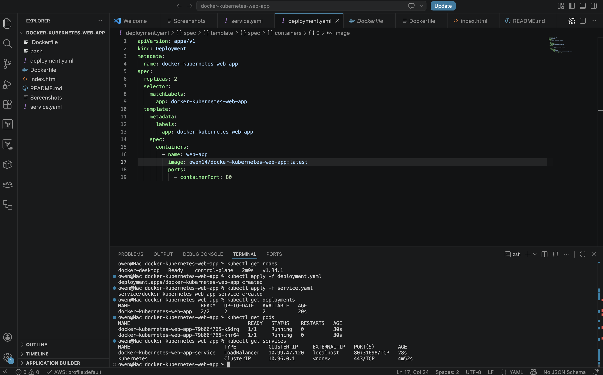
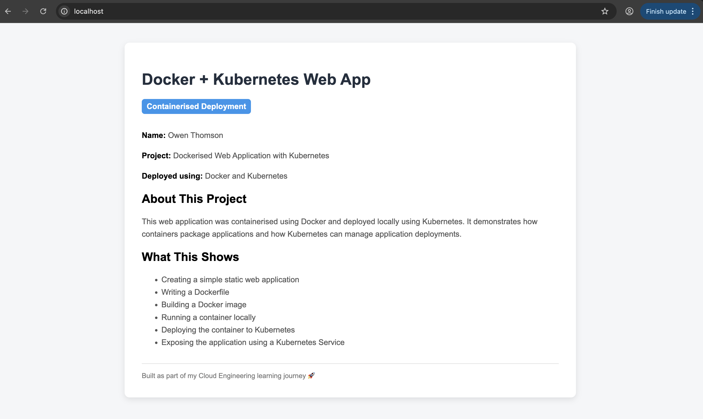

# Dockerised Web App with Kubernetes Deployment

> Containerised web application built with Docker and deployed locally using Kubernetes.

---

## Overview

This project demonstrates how to containerise a simple static web application using **Docker** and deploy it locally using **Kubernetes**.

The application is packaged into a Docker image, pushed to Docker Hub, deployed as a Kubernetes Deployment with multiple replicas, and exposed through a Kubernetes Service.

This project shows core containerisation and orchestration concepts used in cloud engineering, DevOps, and infrastructure support roles.

---

## Architecture

- Static web application created using HTML and CSS
- Dockerfile used to build a container image
- Nginx used as the web server inside the container
- Docker image pushed to Docker Hub
- Kubernetes Deployment created with 2 replicas
- Kubernetes Service used to expose the application locally
- Docker Desktop Kubernetes used as the local Kubernetes cluster

---

## Technologies Used

- Docker
- Docker Hub
- Kubernetes
- kubectl
- Nginx
- HTML
- CSS
- YAML
- VS Code

---

## Features

- Static website served from an Nginx container
- Docker image built locally
- Container tested locally using Docker
- Image pushed to Docker Hub
- Kubernetes Deployment created from YAML
- Two application replicas deployed
- Kubernetes Service used to expose the web application
- Local Kubernetes cleanup completed after testing

---

## How It Works

1. A simple `index.html` web page was created.
2. A `Dockerfile` was written using the `nginx:alpine` base image.
3. The website file was copied into the Nginx web directory inside the container.
4. A Docker image was built locally.
5. The container was run locally and tested in the browser.
6. The image was tagged and pushed to Docker Hub.
7. A Kubernetes Deployment was created using `deployment.yaml`.
8. A Kubernetes Service was created using `service.yaml`.
9. Kubernetes ran two replicas of the web application.
10. The application was opened locally through the Kubernetes service.
11. Kubernetes resources were deleted after testing.

---

## Dockerfile

```dockerfile
FROM nginx:alpine

COPY index.html /usr/share/nginx/html/index.html

EXPOSE 80
```

---

## Kubernetes Deployment

The deployment file is stored in:

```text
deployment.yaml
```

It creates two replicas of the web application using the Docker image pushed to Docker Hub.

---

## Kubernetes Service

The service file is stored in:

```text
service.yaml
```

It exposes the web application locally using a Kubernetes Service.

---

## Screenshots

### Docker Container Running in Browser



---

### Docker Container Running in Terminal



---

### Docker Hub Image Pushed



---

### Kubernetes Node Ready



---

### Kubernetes Resources Running



---

### Kubernetes Web App Live



---

## Project Files

```text
docker-kubernetes-web-app/
├── README.md
├── index.html
├── Dockerfile
├── deployment.yaml
├── service.yaml
└── Screenshots/
    ├── docker-container-running.png
    ├── docker-ps-running.png
    ├── dockerhub-image-pushed.png
    ├── kubernetes-node-ready.png
    ├── kubernetes-resources-running.png
    └── kubernetes-web-app-live.png
```

---

## What I Learned

- How Docker packages an application into a container image
- How to write a basic Dockerfile
- How to build and run a Docker container locally
- How to tag and push an image to Docker Hub
- How Kubernetes Deployments manage application replicas
- How Kubernetes Services expose applications
- How to use `kubectl` to view nodes, pods, deployments, and services
- How to clean up Kubernetes resources after testing

---

## Why This Project Matters

This project demonstrates foundational containerisation and orchestration skills.

Docker and Kubernetes are widely used in cloud engineering, DevOps, infrastructure support, and platform engineering environments. Understanding how to build, run, deploy, expose, and clean up containerised applications is an important step toward working with modern cloud-native systems.

---

## Status

Project completed successfully.

The web application was containerised with Docker, pushed to Docker Hub, deployed locally using Kubernetes, exposed through a Kubernetes Service, and cleaned up after testing.
